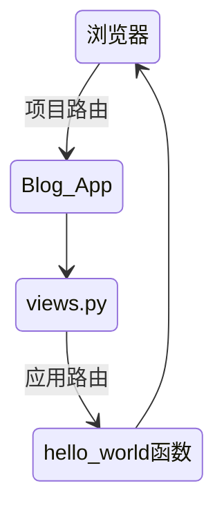

# Django Web框架入门 博客

# 第一章：课程准备

## 课程导学

## 基本环境安装

1. python环境安装
   + 原生python环境
   + 科学计算Anaconda2环境
2. Django环境
   + 版本2.0
   + python包管理工具：pip
3. PyCharm IDE

# 第二章：Django项目初体验

## 初识Django项目

1. 配置文件
2. 项目管理文件
3. 路由文件

### Django基本命令

```python
django-admin
#创建一个django的项目
startproject
#启动django的应用
startapp
#校验项目的完整性
check
#进入django的环境并且运行django的项目
runserver
#进入django项目的Python Shell的命令
shell
#执行Django用例测试
test

#数据库相关
#创建模型变更的迁移文件
makemigrations
#执行上一个命令创建的迁移文件
migrate
#把数据库数据导出到文件
dumpdata
#把文件数据导入到数据库
loaddata
```

 创建一个项目`django-admin startproject django_introduction`

### 项目目录的介绍

```python
# ----Python_Django_Blog\
#     |----.idea\
#     |    |----.gitignore
#     |    |----inspectionProfiles\
#     |    |    |----profiles_settings.xml
#     |    |----misc.xml
#     |    |----modules.xml
#     |    |----Python_Django_Blog.iml
#     |    |----workspace.xml
#     |----manage.py		——项目管理文件
#     |----Python_Django_Blog\
#     |    |----asgi.py
#     |    |----settings.py	——项目配置文件
#     |    |----urls.py		——项目路由配置文件
#     |    |----wsgi.py
#     |    |----__init__.py
#     |----README.md
```

运行初始化的django项目`python manage.py runserver`

## 初识Django应用

1. 应用与项目的区别与联系
2. 应用的文件
   + models.py
   + views.py
   + apps.py
   + test.py
   + urls.py

### Django HelloWorld

1. 两个重要概念
   + 视图
   + 路由
2. HelloWorld视图函数的实现过程

### Django应用 VS Django项目

+ 一个Django项目就是一个基于Django的Web应用
+ 一个Django应用就是一个可重用的Python软件包
+ 每个应用可以自己管理模型、视图、模板、路由和静态文件等
  + 模型、视图 是**应用**范围的概念
  + 模板、路由和静态文件 属于项目级别/应用级别
+ 一个Django项目包含一组配置和若干个Django应用
+ 一个Django的应用是一个可重用的Python软件包
+ 一个Django的应用可以同时应用到多个Django的项目里面

### Django应用目录的介绍

创建blog应用`python manage.py startapp blog`

```python
# ----Python_Django_Blog\
#     |----blog\
#     |    |----admin.py	定义Admin模块管理对象
#     |    |----apps.py		声明应用
#     |    |----migrations\
#     |    |    |----__init__.py
#     |    |----models.py	定义应用模型
#     |    |----tests.py	编写应用测试用例
#     |    |----views.py	视图处理
#     |    |----urls.py	(自行创建)管理应用路由
#     |    |----__init__.py
```



# 

# 第三章：初识Django模型层

## 模型层简介

1. 是什么

   + 位于Django视图层和数据库之间
   + Python对象和数据库表之间的转换

2. 为什么

   + 屏蔽不同数据库之间的差异
   + 开发者更加专注于业务逻辑的开发
   + 提供很多便捷工具有助于开发

3. 相关配置

   ```python
   #settings.py
   DATABASES = {
       'default': {
           #数据库驱动
           'ENGINE': 'django.db.backends.sqlite3',
           #数据库文件
           'NAME': BASE_DIR / 'db.sqlite3',
       }
   }
   ```

## 创建博客文章模型

1. 模型的设计

   + 文章标题——文本类型
   + 文章摘要——文本类型
   + 文章内容——文本类型
   + 唯一ID标记——Int数字类型（自增、主键）
   + 发布日期——日期类型

2. Django模型层的字段

   + 数字类型：IntegerField
   + 文本类型：TextField
   + 日期类型：DateTimeField
   + 自增ID：AutoField
   + 主键定义:primary_key属性

3. 编写类

   ```python
   #models.py
   from django.db import models
   
   
   # Create your models here.
   
   class Article(models.Model):
       # 唯一ID
       article_id = models.AutoField(primary_key=True)
       # 文章标题
       title = models.TextField()
       # 文章摘要
       brief_content = models.TextField()
       # 文章内容
       content = models.TextField()
       # 文章日期
       publish_date = models.DateTimeField(auto_now=True)
   	
       # 管理页面展示
       def __str__(self):
           return self.title
   ```

   

4. 生成迁移文件`python manage.py makemigrations`

5. 运行迁移文件`python manage.py migrate`

## 初始Django Shell

1. 是什么（类似Javascript，便捷调试）

   + Python Shell,用于交互式的Python编程
   + Django Shell，继承Django项目环境

2. 为什么

   + 临时性操作使用Django Shell更加方便
   + 先范围Debug更简单，不需要运行整个项目来测试
   + 方便开发、方便调试、方便Debug

3. 怎么用

   + 新建一篇文章

4. 进入Django Shell环境`python manage.py shell`

   ```python
   from blig.models import Article
   a = Article()
   a.title = 'Test Django Shell'
   a.brief_content = 'Test Content'
   a.content = 'Test Django Shell'
   print(a)
   #Article object (None)
   articles = Articles.objects.all()
   print(len(artucles))
   #1
   article = articles[0]
   print(article.title)
   #Test Django Shell
   ```

   

## 初识Django Admin模块

1. 是什么
   + Django的后台管理工具
   + 读取定义的模型元数据，提供强大的管理使用页面
2. 为什么
   + Django Shell新增文章太复杂
   + 管理页面是基础设施中重要的部分
   + 认证用户、显示管理模型、校验输入等功能类似
3. 怎么用
   + 创建管理员用户`python manage.py createsuperuser`
   + 登录页面进行管理`python manage.py runserver`

## 实现博客数据返回页面

初步打通浏览器-视图层-模型层

# 第四章：初始Django视图与模板

## 使用Boostrap实现静态博客页面

1. Boostrap的介绍
   + 来自美国Twitter的前端框架
   + 提供非常多的控件并附带源码
   + 栅格系统把页面均分为十二等份
2. 页面的设计
   + 博客首页
   + 文章细节页
3. 页面的实现
   + 博客首页
   + 文章细节页

## 初始Django模板系统

1. 简介

   + 视图文件不适合编码HTML
   + 页面设计改变需要修改Python代码
   + 网页逻辑和网页视图应该分开设计
   + 模板系统的表现形式是文本
   + 分离文档的表现形式和表现内容
   + 模板系统定义了特有的标签占位符

2. 基本语法（怎么用）

   + 变量标签

     ```html
     <!-- {{变量}} -->
     <html><body>{{now}}</body></html>
     ```

     

   + for循环标签

     ```html
      <!-- , -->
     <ul>
     	
         <li>{{ x }}</li>
         
     </ul>
     ```

     

   + if-else判断标签

     ```html
     <!-- ,, -->
     <div>
     
     	<p>is true</p>
     
     	<p>is false</p>
     
     </div>
     ```

     

## 使用模板系统渲染博客页面

1. 渲染博客首页
2. 渲染文章细节页
3. 实现视图函数逻辑

## 实现文章详情页面跳转

1. URL的重新设计
2. 获取URL参数的方法
3. 视图函数的改造

## 实现上下篇文章的跳转

1. Boostrap相关组件
2. 上下篇文章的链接

## 实现分页功能

1. URL的分页设计

2. Django Page组件的使用`python manage.py shell`

   ```python
   from django.core.paginator import Paginator
   l = [1,2,3,4]
   p = Paginator(l,2)
   p.num_pages
   #2
   print(p.page(1).object_list)
   #[1,2]
   print(p.page(2).object_list)
   #[3,4]
   p.page(1).has_next()
   #True
   p.page(2).has_next()
   #False
   p.page(1).has_previous()
   #True
   p.page(2).has_previous()
   #False
   ```

   

## 实现最新文章列表功能

1. 数据库内容排序

   ```python
   # 最近10篇文章 倒叙排列
       top10_article_list = Article.objects.order_by('-publish_date')[:10]
   ```

   


