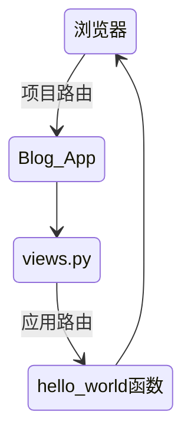

## Django基本命令

```python
django-admin
#创建一个django的项目
startproject
#启动django的应用
startapp
#校验项目的完整性
check
#进入django的环境并且运行django的项目
runserver
#进入django项目的Python Shell的命令
shell
#执行Django用例测试
test

#数据库相关
#创建模型变更的迁移文件
makemigrations
#执行上一个命令创建的迁移文件
migrate
#把数据库数据导出到文件
dumpdata
#把文件数据导入到数据库
loaddata
```

 创建一个项目`django-admin startproject django_introduction`

## 项目目录的介绍

```python
# ----Python_Django_Blog\
#     |----.idea\
#     |    |----.gitignore
#     |    |----inspectionProfiles\
#     |    |    |----profiles_settings.xml
#     |    |----misc.xml
#     |    |----modules.xml
#     |    |----Python_Django_Blog.iml
#     |    |----workspace.xml
#     |----manage.py		——项目管理文件
#     |----Python_Django_Blog\
#     |    |----asgi.py
#     |    |----settings.py	——项目配置文件
#     |    |----urls.py		——项目路由配置文件
#     |    |----wsgi.py
#     |    |----__init__.py
#     |----README.md
```

运行初始化的django项目`python manage.py runserver`

## 初识Django应用

### Django应用 VS Django项目

+ 一个Django项目就是一个基于Django的Web应用
+ 一个Django应用就是一个可重用的Python软件包
+ 每个应用可以自己管理模型、视图、模板、路由和静态文件等
  + 模型、视图 是**应用**范围的概念
  + 模板、路由和静态文件 属于项目级别/应用级别
+ 一个Django项目包含一组配置和若干个Django应用
+ 一个Django的应用是一个可重用的Python软件包
+ 一个Django的应用可以同时应用到多个Django的项目里面

### Django应用目录的介绍

创建blog应用`python manage.py startapp blog`

```python
# ----Python_Django_Blog\
#     |----blog\
#     |    |----admin.py	定义Admin模块管理对象
#     |    |----apps.py		声明应用
#     |    |----migrations\
#     |    |    |----__init__.py
#     |    |----models.py	定义应用模型
#     |    |----tests.py	编写应用测试用例
#     |    |----views.py	视图处理
#     |    |----urls.py	(自行创建)管理应用路由
#     |    |----__init__.py
```



